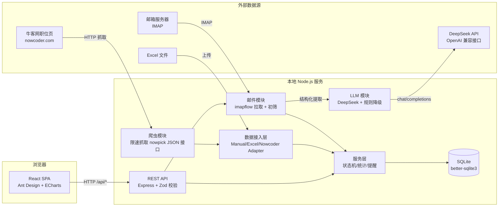

# 02 系统架构设计

> 版本：v1.0 ｜ 状态：待评审

## 1. 总体架构

采用**前后端分离 + 本地 SQLite** 的单进程（开发期双进程）架构。部署形态为"本地 Web 应用"：浏览器访问前端，前端通过 HTTP 调用本地后端 API。



- 开发期：Vite dev server（5173）代理 `/api` 到 Express（3001），根目录 `pnpm dev` 一键并行启动；
- 生产期（可选）：`server` 静态托管 `client/dist`，单进程 `pnpm start`。

## 2. 技术选型与理由

| 决策点 | 选择 | 理由 |
| --- | --- | --- |
| 前端框架 | React 18 + TypeScript + Vite | 生态成熟、组件丰富、开发体验好 |
| UI 组件库 | Ant Design 5 | 表格/表单/日期/标签组件齐全，适合数据管理型界面 |
| 服务端状态 | TanStack Query | 声明式缓存、失效重取，天然适合"实时"看板 |
| 图表 | ECharts | 趋势图/漏斗图支持好 |
| 后端框架 | Express 4 + TypeScript | 轻量、中间件生态成熟 |
| 数据库 | SQLite + better-sqlite3 | 零配置、单文件易备份、同步 API 简单可靠 |
| 数据校验 | Zod | 前后端可共享 schema，请求体校验简洁 |
| 表格解析 | SheetJS (xlsx) | 读写 .xlsx 事实标准 |
| 爬虫接入 | fetch（JSON 接口） | 直连牛客网公开搜索接口（nowpick 网关），无需无头浏览器 |
| 页面解析 | cheerio | 官网 JD 链接解析（提取标题/描述预填表单） |
| 邮件接入 | imapflow | 纯 JS IMAP 客户端，支持 QQ/163/Outlook 等授权码登录 |
| AI 分析 | DeepSeek API（OpenAI 兼容） | 邮件结构化提取；未配置 Key 时降级本地规则提取 |
| 包管理 | pnpm workspaces | 单仓库管理前后端，一条命令安装/启动 |

## 3. 模块划分与目录结构

```
FindJob/
├── package.json            # workspace 根：install/dev/build/start 脚本
├── pnpm-workspace.yaml
├── README.md
├── docs/                   # 设计文档
├── client/                 # 前端
│   ├── vite.config.ts      # /api 代理
│   └── src/
│       ├── api/            # HTTP 客户端 + 各资源 API 封装
│       ├── components/     # 通用组件（StatusTag/StatCard/Timeline…）
│       ├── pages/          # Dashboard/Applications/ApplicationDetail/Companies/Today/Settings
│       ├── hooks/          # useStats/useApplications 等查询封装
│       ├── stores/         # zustand：UI 筛选状态
│       ├── types/          # 与后端共享的领域类型
│       └── utils/          # 常量映射（状态→中文/颜色）、日期工具
└── server/                 # 后端
    └── src/
        ├── index.ts        # 入口：装配中间件/路由/启动
        ├── config.ts       # 端口、DB 路径
        ├── db/
        │   ├── connection.ts   # better-sqlite3 连接
        │   └── migrations.ts   # 建表迁移（user_version 版本号）
        ├── domain/
        │   ├── status.ts       # 状态枚举 + 流转规则（唯一事实源）
        │   └── types.ts        # 领域类型
        ├── routes/         # 路由层：参数解析与校验
        ├── controllers/    # 控制层：HTTP 语义、响应组装
        ├── services/       # 服务层：业务规则（状态机校验、统计口径）
        ├── services/email/ # 邮件模块：IMAP 拉取、初筛、分析编排（见文档 04 §3.8）
        ├── services/llm/   # LLM 模块：DeepSeek 客户端 + zod 结构校验 + 规则降级
        ├── adapters/       # 数据接入层：manual / excel / nowcoder 适配器 + 注册表（见文档 06）
        ├── middleware/     # 错误处理、请求日志
        └── utils/          # 分页、时间工具
```

## 4. 分层职责

| 层 | 职责 | 禁止 |
| --- | --- | --- |
| routes | 绑定路径 → controller，用 Zod 解析参数 | 写业务逻辑 |
| controllers | 组装 HTTP 响应、错误映射 | 直接写 SQL |
| services | 业务规则：状态机合法性、统计口径、提醒逻辑 | 处理 HTTP 细节 |
| db / adapters | 数据读写、迁移 | 业务判断 |

依赖方向：`routes → controllers → services → db`，严格单向。

## 5. 关键设计决策（ADR 摘要）

### ADR-1 状态机放服务端，唯一事实源
状态枚举与流转表定义在 `server/src/domain/status.ts`，前端仅做展示与可用操作渲染。理由：保证非法流转不可能通过 API 发生；前端映射表由该文件生成的常量维护，避免两处漂移。

### ADR-2 状态变更事件化（事件溯源）
每次状态流转写入 `timeline_events`，时间线不单独存字段。理由：天然获得完整历史；趋势统计直接聚合事件流。

### ADR-3 统计走预聚合查询，不引入缓存
数据量 ≤ 3000 条时，SQLite 分组聚合足够快（P95 < 300ms）。理由：避免缓存一致性复杂度，"实时"语义最直接。

### ADR-4 单文件 SQLite + 编号迁移
`migrations.ts` 用 `PRAGMA user_version` 顺序执行迁移脚本。理由：零运维、易备份（直接复制文件）。

### ADR-5 数据接入层统一 Adapter 接口
手动录入、Excel 导入、爬虫抓取都走同一 `JobSourceAdapter` 接口归一化为统一记录后入库（见文档 06）。理由：新增数据源不侵入核心逻辑。

### ADR-6 爬虫直连牛客网公开 JSON 搜索接口 + 限速，不做反爬对抗
牛客网职位列表由 Vue SPA 渲染，数据来自公开接口 `POST nowpick.nowcoder.com/u/job/search`（表单编码，携带 UA/Origin/Referer 即可，无需登录态）。直接调用该接口解析 JSON（结构见文档 06 §4），无需无头浏览器；请求间隔 ≥ 1.5s、默认最多抓 3 页（上限 10），抓取结果仅作「预览 → 勾选导入」，不落库缓存。理由：够用、可预测、合规风险最小；接口结构变化时只需修改解析器。

### ADR-7 邮件分析采用「LLM 提取 + 本地规则降级 + 人工确认」三级策略
邮件初筛用本地关键词规则（零成本、可解释）；结构化提取默认走 DeepSeek（OpenAI 兼容接口，成本低、中文效果好）；未配置 Key 或调用失败时降级本地正则提取并标记低置信度；所有提取结果必须经用户在 UI 确认后才写入时间线/提醒，AI 不直接改状态机。理由：成本可控、失败有兜底、错误可纠正。

### ADR-8 敏感配置本地存储、接口脱敏、导出隔离
邮箱授权码与 API Key 存本地 SQLite `settings` 表；读取接口返回脱敏值（仅返回「是否已配置」）；Excel 导出仅包含业务数据。理由：单用户本地应用的最小可行安全边界。

## 6. 数据流示例：一次状态流转

```
用户点击「进入一面」
  → PATCH /api/applications/:id/transitions { toStatus: INTERVIEW_1 }
  → controller 校验参数 → service 校验流转合法
  → 事务：更新 applications.status/updated_at + 插入 timeline_events(status_change)
  → 返回更新后的申请与事件
  → 前端 invalidate [applications]/[stats] → 看板与列表实时刷新
```

## 7. 数据流示例：爬虫导入

```
用户打开「数据源」页 → 输入关键词/类型/页数 → POST /api/crawl
  → NowcoderAdapter 限速抓取职位列表 → 归一化为 RawJobRecord[]
  → 前端预览勾选 → POST /api/import/records
  → ImportService 查重/校验/入库 → 返回 ImportResult → 列表/看板刷新
```

## 7b. 数据流示例：邮件智能分析

```
用户配置邮箱(IMAP)与 DeepSeek Key → POST /api/email/analyze { days: 14 }
  → 邮件模块 IMAP 拉取 → 关键词初筛 → message-id 去重
  → LLM 模块批量提取结构化 JSON（失败降级本地规则）
  → 结果存 email_items(pending) → 前端卡片列表展示
  → 用户点「应用」→ 匹配公司 → 生成时间线笔记事件 + 未来时间建提醒 → 状态 confirmed
```

## 8. 部署形态

| 形态 | 命令 | 说明 |
| --- | --- | --- |
| 开发 | `pnpm dev` | Vite(5173) + Express(3001) 并行，代理 /api |
| 生产 | `pnpm build && pnpm start` | Express 托管 client/dist，单端口访问 |
