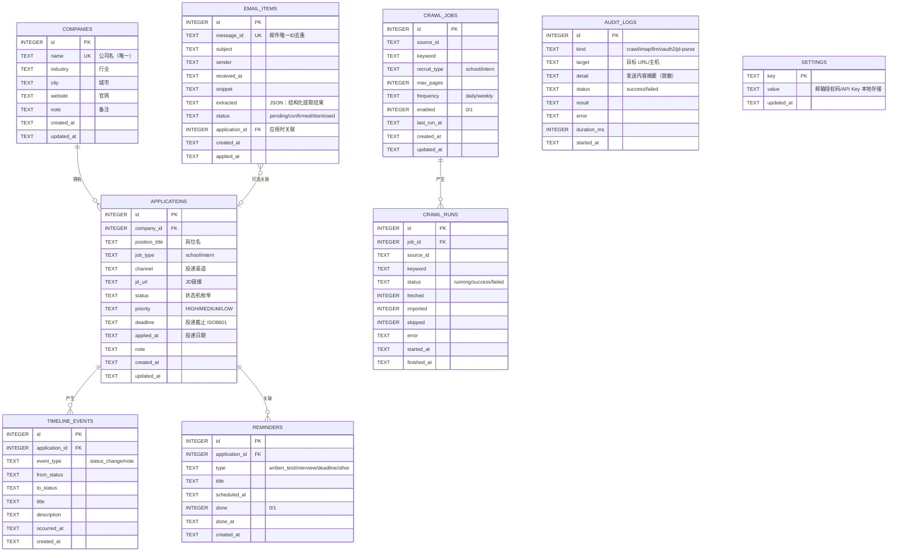

# 03 数据库设计

> 版本：v1.0 ｜ 状态：待评审 ｜ 数据库：SQLite

## 1. ER 图



## 2. 表结构

### 2.1 companies（公司）

| 字段 | 类型 | 约束 | 说明 |
| --- | --- | --- | --- |
| id | INTEGER | PK, AUTOINCREMENT | 主键 |
| name | TEXT | NOT NULL, UNIQUE | 公司名（去重依据，录入时先查重） |
| industry | TEXT | 可空 | 行业，如「互联网」 |
| city | TEXT | 可空 | 城市 |
| website | TEXT | 可空 | 官网 |
| note | TEXT | 可空 | 备注 |
| created_at | TEXT | NOT NULL | ISO 8601 本地时间 |
| updated_at | TEXT | NOT NULL | ISO 8601 本地时间 |

### 2.2 applications（投递申请，核心表）

| 字段 | 类型 | 约束 | 说明 |
| --- | --- | --- | --- |
| id | INTEGER | PK, AUTOINCREMENT | 主键 |
| company_id | INTEGER | NOT NULL, FK→companies, ON DELETE CASCADE | 所属公司 |
| position_title | TEXT | NOT NULL | 岗位名，如「后端开发工程师」 |
| job_type | TEXT | NOT NULL, DEFAULT 'school' | school 校招 / intern 实习 |
| channel | TEXT | 可空 | 投递渠道：官网/牛客/Boss直聘/内推/其他 |
| jd_url | TEXT | 可空 | JD 链接 |
| status | TEXT | NOT NULL, DEFAULT 'WISHLIST' | 状态机枚举（见 3.1） |
| priority | TEXT | NOT NULL, DEFAULT 'MEDIUM' | HIGH / MEDIUM / LOW |
| deadline | TEXT | 可空 | 投递截止时间（ISO 8601） |
| applied_at | TEXT | 可空 | 投递日期（YYYY-MM-DD） |
| note | TEXT | 可空 | 备注 |
| created_at | TEXT | NOT NULL | 创建时间 |
| updated_at | TEXT | NOT NULL | 最后更新时间（状态流转时同步刷新） |

索引：

```sql
CREATE INDEX idx_app_company ON applications(company_id);
CREATE INDEX idx_app_status  ON applications(status);
CREATE INDEX idx_app_deadline ON applications(deadline);
CREATE INDEX idx_app_updated  ON applications(updated_at DESC);
```

### 2.3 timeline_events（时间线事件，事件溯源）

| 字段 | 类型 | 约束 | 说明 |
| --- | --- | --- | --- |
| id | INTEGER | PK, AUTOINCREMENT | 主键 |
| application_id | INTEGER | NOT NULL, FK→applications, ON DELETE CASCADE | 所属申请 |
| event_type | TEXT | NOT NULL | status_change（状态流转）/ note（笔记） |
| from_status | TEXT | 可空 | 流转前状态（仅 status_change） |
| to_status | TEXT | 可空 | 流转后状态（仅 status_change） |
| title | TEXT | NOT NULL | 事件标题，如「状态更新：已投递 → 笔试」 |
| description | TEXT | 可空 | 补充说明 |
| occurred_at | TEXT | NOT NULL | 事件发生时间（ISO 8601） |
| created_at | TEXT | NOT NULL | 记录创建时间 |

索引：

```sql
CREATE INDEX idx_tl_app ON timeline_events(application_id, occurred_at DESC);
CREATE INDEX idx_tl_occurred ON timeline_events(occurred_at);
```

> 趋势统计依赖 `idx_tl_occurred` + event_type=status_change 按天聚合。

### 2.4 reminders（提醒）

| 字段 | 类型 | 约束 | 说明 |
| --- | --- | --- | --- |
| id | INTEGER | PK, AUTOINCREMENT | 主键 |
| application_id | INTEGER | NOT NULL, FK→applications, ON DELETE CASCADE | 关联申请 |
| type | TEXT | NOT NULL | written_test 笔试 / interview 面试 / deadline 截止 / other 其他 |
| title | TEXT | NOT NULL | 如「字节跳动 一面」 |
| scheduled_at | TEXT | NOT NULL | 提醒时间（ISO 8601） |
| done | INTEGER | NOT NULL, DEFAULT 0 | 0 未完成 / 1 已完成 |
| done_at | TEXT | 可空 | 完成时间 |
| created_at | TEXT | NOT NULL | 创建时间 |

索引：

```sql
CREATE INDEX idx_rem_scheduled ON reminders(scheduled_at);
CREATE INDEX idx_rem_app ON reminders(application_id);
```

### 2.5 settings（应用配置，键值对）

| 字段 | 类型 | 约束 | 说明 |
| --- | --- | --- | --- |
| key | TEXT | PK | 配置键 |
| value | TEXT | NOT NULL | 配置值 |
| updated_at | TEXT | NOT NULL | 更新时间 |

v1 配置键：

| key | 说明 |
| --- | --- |
| email.host / email.port / email.secure | IMAP 服务器 / 端口 / 是否 TLS |
| email.user / email.password | 邮箱账号 / 授权码 |
| email.folder | 邮件文件夹（默认 INBOX） |
| llm.baseUrl | LLM API 地址（默认 https://api.deepseek.com，兼容 OpenAI 接口） |
| llm.apiKey | API Key |
| llm.model | 模型（默认 deepseek-chat） |

> 安全说明：value 含敏感信息，仅存本地；`GET /api/settings` 返回脱敏值；Excel 导出不含本表。

### 2.6 email_items（邮件分析记录）

| 字段 | 类型 | 约束 | 说明 |
| --- | --- | --- | --- |
| id | INTEGER | PK, AUTOINCREMENT | 主键 |
| message_id | TEXT | NOT NULL, UNIQUE | 邮件唯一 ID，拉取去重依据 |
| subject | TEXT | NOT NULL | 主题 |
| sender | TEXT | 可空 | 发件人（名称 + 地址） |
| received_at | TEXT | NOT NULL | 收件时间（ISO 8601） |
| snippet | TEXT | 可空 | 正文摘要（截断 300 字，供 LLM 与展示） |
| extracted | TEXT | 可空 | 结构化提取结果 JSON（见 3.3） |
| status | TEXT | NOT NULL, DEFAULT 'pending' | pending 待处理 / confirmed 已应用 / dismissed 已忽略 |
| application_id | INTEGER | 可空, FK→applications, ON DELETE SET NULL | 应用时关联的申请 |
| created_at | TEXT | NOT NULL | 分析时间 |
| applied_at | TEXT | 可空 | 应用时间 |

索引：

```sql
CREATE INDEX idx_email_received ON email_items(received_at DESC);
CREATE INDEX idx_email_status ON email_items(status);
```

### 2.7 crawl_jobs（定时抓取任务，v1.1）

| 字段 | 类型 | 约束 | 说明 |
| --- | --- | --- | --- |
| id | INTEGER | PK, AUTOINCREMENT | 主键 |
| source_id | TEXT | NOT NULL | 数据源（v1：nowcoder） |
| keyword | TEXT | NOT NULL | 抓取关键词 |
| recruit_type | TEXT | NOT NULL, DEFAULT 'school' | school / intern |
| max_pages | INTEGER | NOT NULL, DEFAULT 3 | 每次抓取页数（1-10） |
| frequency | TEXT | NOT NULL, DEFAULT 'daily' | daily / weekly |
| enabled | INTEGER | NOT NULL, DEFAULT 1 | 0 停用 / 1 启用 |
| last_run_at | TEXT | 可空 | 上次执行时间（到期判断依据；失败也更新，避免每分钟重试） |
| created_at / updated_at | TEXT | NOT NULL | 时间戳 |

### 2.8 crawl_runs（抓取运行历史，v1.1）

| 字段 | 类型 | 约束 | 说明 |
| --- | --- | --- | --- |
| id | INTEGER | PK, AUTOINCREMENT | 主键 |
| job_id | INTEGER | FK→crawl_jobs, ON DELETE CASCADE | 所属任务（可空） |
| source_id | TEXT | NOT NULL | 数据源 |
| keyword | TEXT | NOT NULL | 关键词快照 |
| status | TEXT | NOT NULL, DEFAULT 'running' | running / success / failed |
| fetched / imported / skipped | INTEGER | NOT NULL, DEFAULT 0 | 抓取数 / 新增导入数 / 去重跳过数 |
| error | TEXT | 可空 | 失败原因 |
| started_at / finished_at | TEXT | 时间戳 |

索引：`idx_crawl_jobs_enabled(enabled)`、`idx_crawl_runs_job(job_id, started_at DESC)`、`idx_crawl_runs_started(started_at DESC)`。

### 2.9 audit_logs（出站调用审计，v1.3）

| 字段 | 类型 | 约束 | 说明 |
| --- | --- | --- | --- |
| id | INTEGER | PK, AUTOINCREMENT | 主键 |
| kind | TEXT | NOT NULL | crawl / imap / llm / oauth2 / jd-parse |
| target | TEXT | NOT NULL | 目标 URL 或主机（如 imap.qq.com:993） |
| detail | TEXT | 可空 | 发送内容摘要（脱敏：凭据永不记录） |
| status | TEXT | NOT NULL | success / failed |
| result / error | TEXT | 可空 | 结果摘要 / 失败原因 |
| duration_ms | INTEGER | 可空 | 耗时 |
| started_at | TEXT | NOT NULL | 调用时间 |

- 索引：`idx_audit_started(started_at DESC)`、`idx_audit_kind(kind)`；
- 自动裁剪：仅保留最近 2000 条；`DELETE /api/audit` 清空。

## 3. 枚举定义

### 3.1 status（投递状态，唯一事实源见 `server/src/domain/status.ts`）

| 枚举值 | 中文 | 是否终态 |
| --- | --- | --- |
| WISHLIST | 待投递 | 否 |
| APPLIED | 已投递 | 否 |
| SCREENING | 简历筛选 | 否 |
| WRITTEN_TEST | 笔试 | 否 |
| INTERVIEW_1 | 一面 | 否 |
| INTERVIEW_2 | 二面 | 否 |
| INTERVIEW_3 | 三面 | 否 |
| HR_INTERVIEW | HR面 | 否 |
| OFFER | Offer | 否 |
| SIGNED | 已签约 | 是 |
| REJECTED | 已拒绝 | 是 |
| WITHDRAWN | 已放弃 | 是 |

### 3.2 其他枚举

- `job_type`：school / intern
- `priority`：HIGH / MEDIUM / LOW
- `timeline_events.event_type`：status_change / note
- `reminders.type`：written_test / interview / deadline / other
- `email_items.status`：pending / confirmed / dismissed
- `crawl_jobs.recruit_type`：school / intern
- `crawl_jobs.frequency`：daily / weekly
- `crawl_runs.status`：running / success / failed
- `audit_logs.kind`：crawl / imap / llm / oauth2 / jd-parse

### 3.3 email_items.extracted（LLM 结构化提取结果 JSON）

```json
{
  "company": "字节跳动",
  "eventType": "interview",           // written_test / interview / assessment / offer / reject / other
  "eventTime": "2025-09-20T14:00:00", // 可空：邮件中提到的笔试/面试时间
  "positionTitle": "后端开发工程师",
  "summary": "一面面试邀请，时间 9月20日 14:00",
  "confidence": 0.92                  // 0-1，规则降级时 ≤ 0.5
}
```

## 4. 迁移策略

- 使用 `PRAGMA user_version` 记录 schema 版本，`migrations.ts` 中按版本号顺序执行数组化迁移脚本（v1 建 6 张表 + 索引，v2 新增 crawl_jobs/crawl_runs，v3 新增 audit_logs）；
- 首次启动自动建库建表；数据文件路径 `server/data/findjob.db`（可经环境变量 `FINDJOB_DB_PATH` 覆盖）；
- 备份 = 复制 db 文件（含 settings，可整体恢复）；恢复 = 替换 db 文件后重启；
- Excel 导出仅含业务数据（companies/applications 派生内容），不含 settings 与 email_items。

## 5. 容量与性能预估

| 场景 | 预估量级 | 设计保障 |
| --- | --- | --- |
| 公司 | ≤ 300 | 主键 + name 唯一索引 |
| 申请 | ≤ 3000 | 状态/更新时间/截止时间复合筛选走索引 |
| 时间线事件 | ≤ 3 万 | (application_id, occurred_at) 联合索引 |
| 提醒 | ≤ 1000 | scheduled_at 索引支持「今日」查询 |
| 邮件分析记录 | ≤ 1 万 | message_id 唯一索引去重，status 索引支持待处理列表 |
