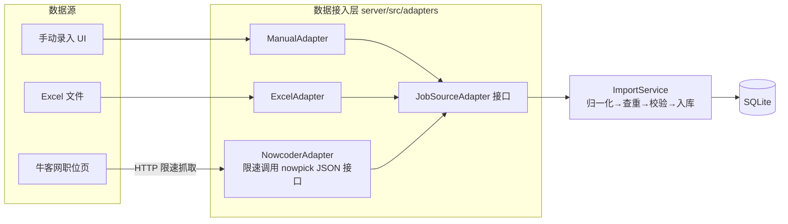

# 06 数据接入层设计

> 版本：v1.0 ｜ 状态：待评审

## 1. 设计目标

投递数据的来源多样（手动录入、历史 Excel、未来可能的爬虫/第三方 API）。数据接入层把「从哪来」与「怎么入库」解耦：**所有来源先归一化为统一的记录结构，再由导入服务统一去重、校验、入库**，新增数据源只需实现一个 Adapter，不触碰核心业务。



## 2. 统一接口定义

```ts
// server/src/adapters/types.ts
/** 归一化后的投递记录（所有来源的统一中间格式） */
export interface RawJobRecord {
  companyName: string;        // 必填
  companyIndustry?: string;
  companyCity?: string;
  companyWebsite?: string;
  positionTitle: string;      // 必填
  jobType?: 'school' | 'intern';
  channel?: string;           // 官网/牛客/Boss直聘/内推/其他
  jdUrl?: string;
  salary?: string;            // 薪资区间文本（展示用，入库时并入 note）
  city?: string;              // 工作城市
  appliedAt?: string;         // YYYY-MM-DD
  deadline?: string;          // ISO 8601
  status?: string;            // 状态机枚举，缺省 WISHLIST
  priority?: 'HIGH' | 'MEDIUM' | 'LOW';
  note?: string;
  /** 来源批次内唯一键，用于同批次去重；留空则按 公司+岗位 去重 */
  sourceKey?: string;
}

export interface JobSourceAdapter {
  readonly id: string;                          // 'manual' | 'excel' | ...
  fetch(): Promise<RawJobRecord[]>;             // 拉取原始记录并归一化
}

export interface ImportResult {
  imported: number;                             // 成功入库
  skipped: number;                              // 重复/已存在跳过
  errors: Array<{ row?: number; message: string }>;
}
```

## 3. 内置适配器

### 3.1 ManualAdapter（手动录入）

- 申请表单提交即构造单条 `RawJobRecord`，走 ImportService 入库；
- 特点：公司名输入时联动搜索已有公司（弹窗内可直接快速新建公司）；
- `sourceKey` 为空 → 按「公司 + 岗位」判断重复：已存在则提示跳转编辑而非重复创建。

### 3.2 ExcelAdapter（Excel 批量导入）

- 解析 `.xlsx`（SheetJS），首行为列名；
- 模板列（`GET /api/export/template` 提供同结构空表）：

| 列 | 必填 | 说明 |
| --- | --- | --- |
| 公司名称 | ✅ | 与 companies.name 匹配或自动新建 |
| 岗位名称 | ✅ | |
| 岗位类型 | | 校招 / 实习（默认校招） |
| 投递渠道 | | 官网 / 牛客 / Boss直聘 / 内推 / 其他 |
| JD链接 | | |
| 投递日期 | | YYYY-MM-DD |
| 截止日期 | | YYYY-MM-DD |
| 当前状态 | | 中文状态名（默认待投递） |
| 优先级 | | 高 / 中 / 低（默认中） |
| 备注 | | |

- 行级容错：单行缺必填/格式错误 → 记入 `errors` 跳过该行，其余正常导入；
- 中文状态名 ↔ 枚举映射复用 `domain/status.ts` 的映射表。

### 3.3 ImportService（统一入库管线）

```
raw record
 → 1. 格式校验（Zod schema，必填/枚举/日期）
 → 2. 规范化（状态中文→枚举、日期解析、trim）
 → 3. 公司查重（按名称）→ 存在则复用 id，不存在则创建
 → 4. 申请去重（公司+岗位已存在则 skipped）
 → 5. 入库 + 生成初始时间线事件（「创建投递记录」，若带状态则含初始状态事件）
```

## 4. 内置适配器：NowcoderAdapter（爬虫数据源）

- **数据接口**（已实测打通）：牛客网职位广场为 Vue SPA，列表数据来自公开 JSON 接口：
  - `POST https://nowpick.nowcoder.com/u/job/search`（`application/x-www-form-urlencoded`）
  - 请求参数：`keyword`（关键词）、`recruitType`（1=校招 2=实习 3=社招）、`page`、`pageSize=20`、`recommend=0`、`requestFrom=0`、`pageSource=5026`、`city`、`careerJobId`
  - 需携带浏览器 UA + `Origin/Referer`（nowcoder.com）请求头，无需登录态
- **响应映射**：`data.datas[]` → 岗位名 `jobName`、公司 `recommendInternCompany.companyName`（兜底 `user.identity[0].companyName`）、城市 `jobCity`、JD 链接 `https://www.nowcoder.com/job/detail/{id}`（`sourceKey = nowcoder:{id}`）；
- **薪资合成**：`salaryShow` 优先；否则 `salaryMin/Max`（≥1000 视为元换算成 K）+ `salaryMonth`>12 时拼 `·N薪`；`salaryType=1` 按日薪输出；
- **截止日期**：`deliverEnd` 毫秒时间戳，仅保留未来 3 年内的有效值；
- **限速与合规**：请求间隔 ≥ 1.5s，默认最多 3 页（可配置，上限 10）；仅抓取公开职位列表，结果仅用于个人投递追踪，不批量缓存/分发；
- **容错**：单页失败跳过该页保留已抓取结果（首页失败则报错）；接口结构变化时只影响本适配器；
- **结果去向**：`fetch()` 返回 `RawJobRecord[]`，经 `POST /api/crawl` 返回前端预览，勾选后经 `POST /api/import/records` 走 ImportService 入库；
- **备注合成**：薪资/城市信息合并写入 `note` 字段（如「薪资：30-50K·16薪；城市：北京」），避免信息丢失。

## 5. 远期扩展：新增数据源规范

未来接入 Boss直聘/拉勾/实习僧等来源时，遵循以下约束，无需改动核心业务代码：

1. 实现 `JobSourceAdapter`，`fetch()` 内完成抓取与归一化；
2. 网络访问遵守目标站点 robots 协议并限速（≥ 1.5s/请求），不做验证码绕过等反爬对抗；
3. 有登录态/复杂反爬的站点，可改为独立脚本（`server/scripts/crawl-*.ts`）导出 JSON 后经 `POST /api/import/records` 提交；
4. Adapter 在 `server/src/adapters/index.ts` 注册表登记（含参数 schema），UI 数据源页自动枚举展示。

> v1 交付 ManualAdapter + ExcelAdapter + NowcoderAdapter。

## 6. 招聘平台可行性分层（多平台支持策略）

不同平台的技术形态与风控差异巨大，按可行性分为三层，v1 只承诺 Tier 1：

| 层级 | 平台/来源 | 技术形态 | 策略 |
| --- | --- | --- | --- |
| Tier 1（v1 内置） | 牛客网 | 公开 JSON 搜索接口（nowpick 网关，无需登录态） | `fetch` 直接调用接口 + 限速，稳定交付 |
| Tier 2（实验性） | Boss直聘、拉勾、实习僧、**应届生网（yingjiesheng.com，2026-08 实测：职位页返回 JS 挑战 renderData，需浏览器执行挑战脚本）** | JS 渲染/JS 挑战 + 强反爬（登录/滑块/风控） | 可选 Playwright 适配器（`server/src/adapters/experimental/`），默认不启用；文档标注：仅个人学习用途、稳定性无保证、需自行承担风控风险 |
| Tier 3（不爬取） | 公司官网招聘页（Moka/北森等系统） | 各家系统不同、多为 JS 渲染、无统一结构 | 用「JD 链接解析」辅助：服务端抓取页面 `<title>`/`meta[description]` 预填表单（`POST /api/utils/parse-jd`），配合手动录入 + 邮件分析完成追踪 |

统一保障：任何来源都归一化为 `RawJobRecord` 走同一条 ImportService 管线；Tier 2 适配器只需实现接口 + 在注册表登记，即可出现在数据源页（标注「实验性」徽标）。

**聚合抓取（v2 M9）**：`POST /api/crawl/many { sourceIds: [], params }` 并行抓取所有已注册数据源，按「公司+岗位」合并去重（优先保留先返回的数据源记录），单源失败不影响整体。当前 Tier 1 仅牛客网，新数据源注册后聚合自动生效。

## 7. 官网投递追踪配合（F14）

- 渠道 `channel = 官网`，`jd_url` 必填推荐；
- 表单内嵌 JdLinkParser：粘贴链接 → 服务端解析标题/描述 → 自动预填岗位名/公司提示；
- 解析失败（JS 渲染页面）不阻塞：仅提示手动填写；
- 官网进展通知走邮件渠道 → 由邮件分析模块（文档 04 §3.8）自动捕获，状态推进仍由用户确认。

## 5. 导出能力（数据出口）

- `GET /api/export/excel`：按当前列表筛选条件导出 `.xlsx`，列结构与导入模板一致（保证「导出→再导入」无损往返）；
- 导出内容含状态中文名，方便外部查看与二次编辑。
